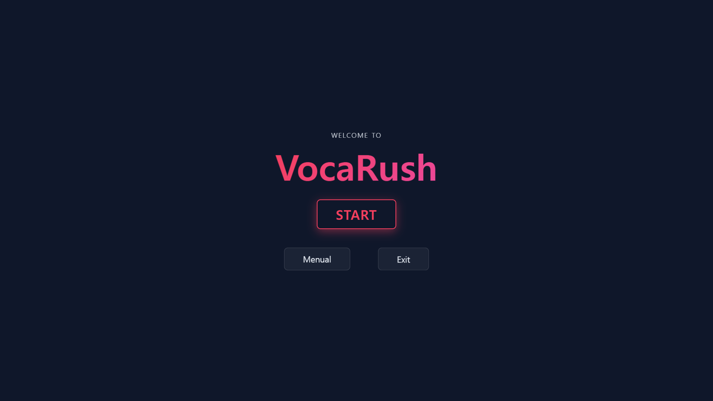
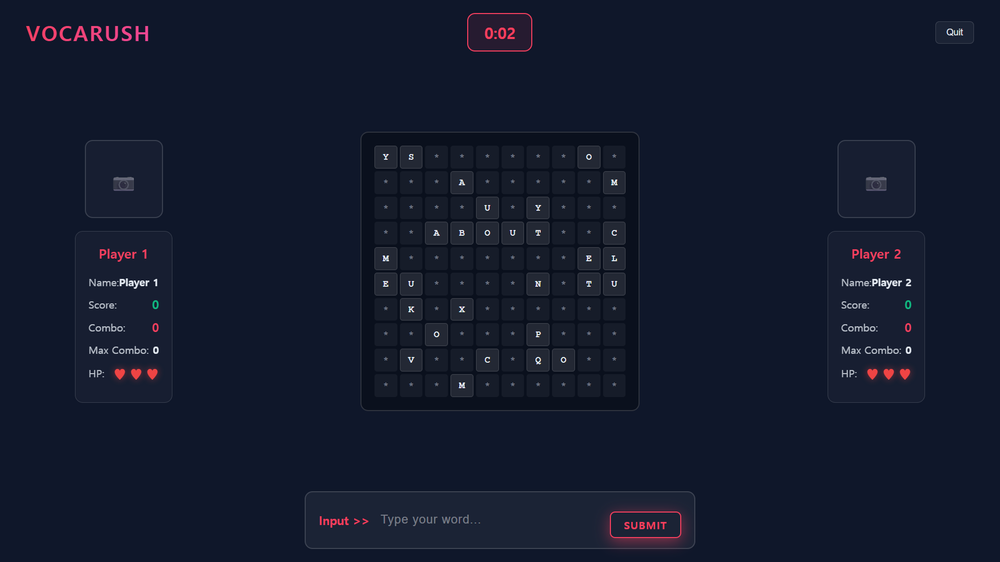
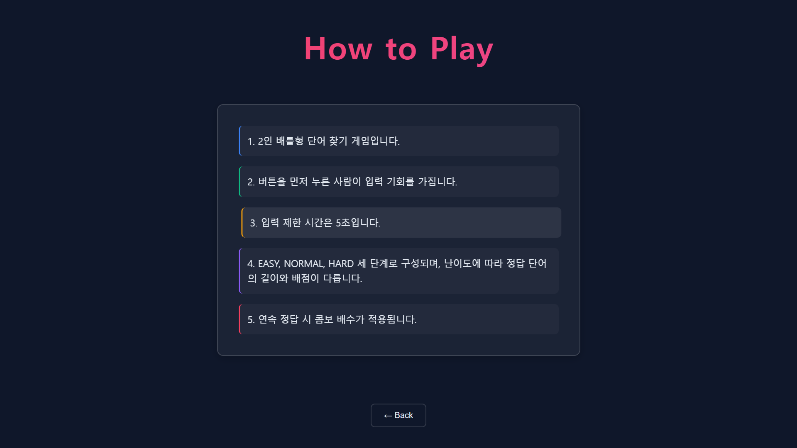
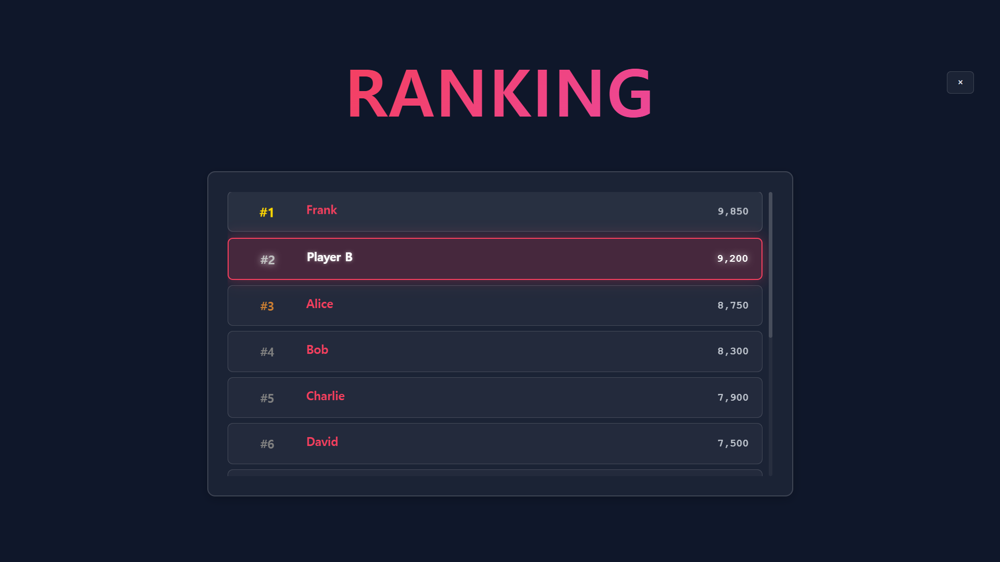
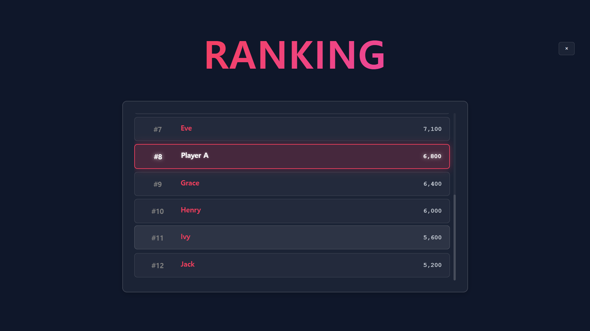
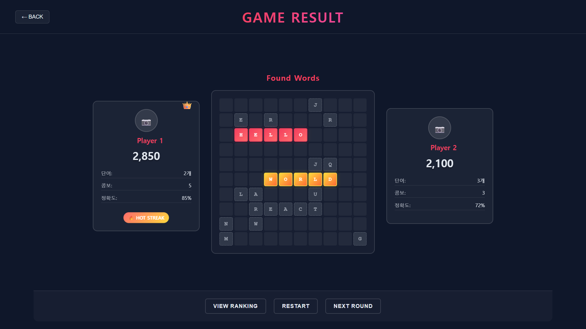

# VocaRush UI (Electron + React)

> **VocaRush**는 콘솔 기반 2인 단어 배틀 게임을  
> **Electron + React** 환경에서 재현한 프로젝트입니다.  
> 기존 콘솔 게임의 룰과 구조를 유지하면서, **UI 시각화와 화면 전환**을 강화했습니다.

---

## 🚩 핵심 특징

- **화면 흐름**: Start → Manual → Game → Result → Ranking → End (Hash Router 기반)  
- **게임 UI**: 플레이어 카드(점수/콤보/HP), 중앙 10×10 보드, 실시간 타이머  
- **스타일**: CSS 변수 기반 커스텀 스타일 (반응형 포함, 글로벌 CSS 변수 활용)

---

## 🛠 기술 스택

- **Runtime**: Electron ^37  
- **UI**: React 18, React DOM 18, React Router v6  
- **Build**: Babel (JSX → `.tmp` 변환 후 실행)  
- **License**: ISC

---

## 📂 디렉터리 구조 (권장)

```bash
src/
├─ main/                 # Electron 메인 프로세스
│  ├─ index.js           # app.whenReady(), activate 핸들러
│  └─ createWindows.js   # BrowserWindow 옵션, index.html 로딩
└─ renderer/             # React 렌더러 프로세스
   ├─ App.jsx            # 라우팅 (react-router-dom, HashRouter)
   └─ views/
      ├─ StartView.jsx
      ├─ ManualView.jsx   
      ├─ GameView.jsx
      ├─ ResultView.jsx
      ├─ RankingView.jsx
      └─ EndView.jsx
root directory/
├─ .babelrc
├─ .gitignore
├─ index.html            # #app 마운트 및 .tmp/renderer/App.js 로드
├─ package-lock.json
├─ package.json
└─ style.css
```

> ※ Electron은 index.html을 로드하고, 해당 HTML이 Babel 빌드 산출물(.tmp/renderer/App.js)을 require하여 React 앱을 실행합니다.

---

## ⚙️ 실행 방법

```bash
# 1) 의존성 설치
npm install

# 2) 개발 실행 (Babel 빌드 후 Electron 구동)
npm build: src → .tmp 디렉터리로 Babel 트랜스파일

npm start: npm run build 후 electron .
```

---

## 🚀 실행 화면
| 화면 | 이미지 |
 |:---:|:---:|
 | **시작 화면** |  | 
 | **게임 화면 1** |  | 
 | **게임 화면 2** |  | 
 | **게임 설명** |  | 
 | **랭킹 화면 1** |  | 
 | **랭킹 화면 2** |  | 
 | **결과 화면** |  |

 ---

## ✨ 한 줄 소개
2인 단어 배틀 게임 — 제한 시간 안에 단어를 찾아내고, 콤보와 정확도로 승부를 가르는 실시간 대전 UI.
